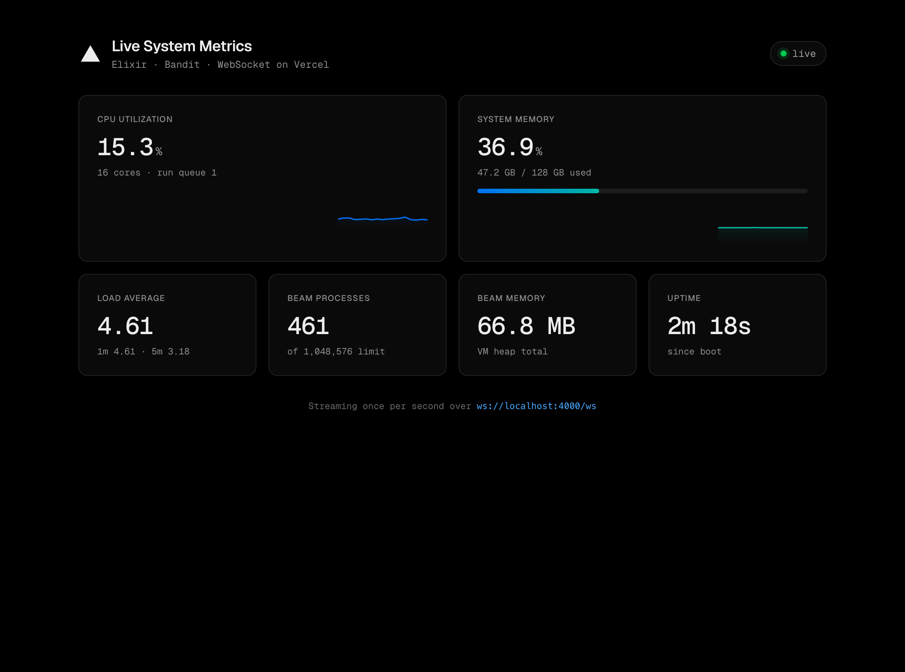

# Elixir Live System Metrics — WebSocket on Vercel

A minimal demo that streams host and BEAM metrics over a WebSocket once per
second, rendered in a static dashboard. It runs as a single OTP release deployed
to Vercel via a Dockerfile, using Vercel's [Dockerfile deployments][docker] and
[WebSocket support][ws] — both of which run on Fluid compute.

[docker]: https://vercel.com/blog/dockerfile-on-vercel
[ws]: https://vercel.com/changelog/websocket-support-is-now-in-public-beta



## How it works

- **`MetricsDemo.Collector`** samples once per second and broadcasts the encoded
  payload to every subscriber through a `:pg` process group. Sampling from a
  single process keeps `:cpu_sup.util/0` accurate and encodes each snapshot once,
  regardless of client count.
- **`MetricsDemo.MetricsSocket`** is a `WebSock` handler. It pushes the latest
  sample on connect, then relays each broadcast.
- **`MetricsDemo.Router`** serves the dashboard and upgrades `/ws`. Bandit is the
  HTTP/WebSocket server.
- **`priv/static/index.html`** is a dependency-free dashboard that reconnects with
  backoff and derives the WebSocket URL from `location` (so `wss://` in
  production, `ws://` locally).

Metrics: CPU utilization, load average, system memory, BEAM process count, BEAM
memory, and uptime.

> [!NOTE]
> `:cpu_sup` and `:memsup` read `/proc` and are not cgroup-aware, so on Vercel
> Fluid the CPU and memory figures reflect the underlying host node, not the
> function's allocated slice. BEAM counters are always the running instance's own.

## Run locally

```sh
mix deps.get
mix run --no-halt
# open http://localhost:4000
```

Run the tests:

```sh
mix test
```

## Run the container

The container listens on `$PORT` (defaults to `80`, matching Vercel).

```sh
docker build -f Dockerfile.vercel -t metrics-demo .
docker run --rm -e PORT=8080 -p 8080:8080 metrics-demo
# open http://localhost:8080
```

## Deploy to Vercel

The presence of `Dockerfile.vercel` makes Vercel build and deploy the container.

```sh
vercel deploy
```

Ensure **Fluid compute** is enabled for the project (the default for new
projects) — both Dockerfile deployments and WebSockets require it. The only
runtime contract is that the server listens on `$PORT`.
